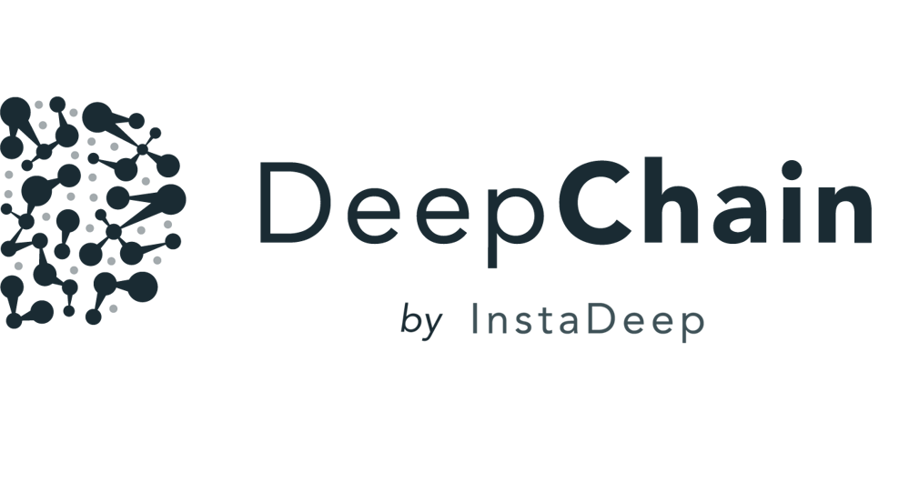

<p align="center">
  
</p>


[](https://opensource.org/licenses/Apache-2.0)
[](https://www.python.org/downloads/release/python-360/)
[](https://github.com/psf/black)


# Description
DeepChain apps is a collaborative framework that allows the user to create scorers to evaluate protein sequences. These scorers can be either Classifiers or Predictors.

This github is hosting a template for creating a personal application to deploy on deepchain.bio. The main [deepchain-apps](https://pypi.org/project/deepchain-apps/) package can be found on pypi.
To leverage the apps capability, take a look at the [bio-transformers](https://pypi.org/project/bio-transformers/) and [bio-datasets](https://pypi.org/project/bio-datasets) package.

## Installation
It is recommended to work with conda environnements in order to manage the specific dependencies of the package.
```bash
  conda create --name deepchain-env python=3.7 -y 
  conda activate deepchain-env
  pip install deepchain-apps
```

# How it works
If you want to create and deploy an app on deepchain hub, you could use the command provided in the [deepchain-apps](https://pypi.org/project/deepchain-apps/) package.
Below are the main commands that should be used in a terminal:

## Basic CLI

```
deepchain login
deepchain create myapplication
```
The last command will download the github files inside the **myapplication** folder.

You can modify the app.py file, as explain in the [Deepchain-apps templates](#deepchain-apps-templates)

To deploy the app on deepchain.bio, use:

```
deepchain deploy myapplication
```

## How generate token to login deepchain?
If you want to deploy biology app on deepchain, you should first create a personal account on [deepchain](https://deepchain.bio/) and go to the user profile section.
As you can see below, you will be able to generate a PAT (personal access token) that you can use with the CLI command:

```
deepchain login
```

<p align="center">
  
</p>


### App structure
When creating an app, you will download the current github folder with the following structure.

```bash
 .
├── README.md # explain how to create an app
├── __init__.py # __init__ file to create python module
├── checkpoint
│   ├── __init__.py
│   └── Optionnal : model.pt # optional: model to be used in app must be placed there
├── examples
│   ├── app_with_checkpoint.py # example: app example with checkpoint
│   └── torch_classifier.py # example: show how to train a neural network with pre-trained embeddings
└── src
    ├── DESC.md # Desciption file of the application, feel free to put a maximum of informations.
    ├── __init__.py
    ├── app.py # main application script. Main class must be named App.
    └── tags.json # file to register the tags on the hub.
```

The main class must be named ```App``` in ```app.py```

### Tags
In order your app to be visible and well documented, tags should be filled to precise at least the *tasks* section.
It will be really useful to retrieve it from deepchain hub.

  - tasks
  - librairies
  - embeddings
  - datasets

# Deepchain-apps templates

Some templates are provided in order to create and deploy an app.
## Examples

You can  implement whatever function you want inside ```compute_scores()``` function. 

It just have to respect to return format: 
One dictionnary for each proteins that are scored. Each keys of the dictionnary are declared in ```score_names()``` function.

```python
[
  {
    'score_names_1':score11
    'score_names_2':score21
  },
   {
    'score_names_1':score12
    'score_names_2':score22
  }
]
```

### Neural Network scorer
An example of training with an embedding is provided in the example/torch_classifier.py script.

Be careful, you must use the same embedding for the training and the ```compute_scores()``` method.


```python
from typing import Dict, List, Optional

import torch
from biotransformers import BioTransformers
from deepchain.components import DeepChainApp
from torch import load

Score = Dict[str, float]
ScoreList = List[Score]


class App(DeepChainApp):
    """DeepChain App template:

    - Implement score_names() and compute_score() methods.
    - Choose a a transformer available on BioTranfformers
    - Choose a personal keras/tensorflow model
    """

    def __init__(self, device: str = "cuda:0"):
        self._device = device
        self.transformer = BioTransformers(backend="protbert", device=device)
        # Make sure to put your checkpoint file in your_app/checkpoint folder
        self._checkpoint_filename: Optional[str] = "model.pt"

        # load_model for tensorflow/keras model-load for pytorch model
        if self._checkpoint_filename is not None:
            self.model = load(self.get_checkpoint_path(__file__))

    @staticmethod
    def score_names() -> List[str]:
        """App Score Names. Must be specified.

        Example:
         return ["max_probability", "min_probability"]
        """
        return ["probability"]

    def compute_scores(self, sequences: List[str]) -> ScoreList:
        """Return a list of all proteins score"""

        x_embedding = self.transformer.compute_embeddings(sequences)["cls"]
        probabilities = self.model(torch.tensor(x_embedding).float())
        probabilities = probabilities.detach().cpu().numpy()

        prob_list = [{self.score_names()[0]: prob[0]} for prob in probabilities]

        return prob_list
```
### Build a classifier 

```python
"""
Module that provide a classifier template to train a model on embeddings.
With use the pathogen vs human dataset as an example. The embedding of 100k proteins come 
from the protBert model.
The model is built with pytorch_ligthning, a wrapper on top of 
pytorch (similar to keras with tensorflow)
Feel feel to build you own model if you want to build a more complex one
"""

from biodatasets import list_datasets, load_dataset
from deepchain.models import MLP
from deepchain.models.utils import confusion_matrix_plot, model_evaluation_accuracy
from sklearn.model_selection import train_test_split

# Load embedding and target dataset
pathogen = load_dataset("pathogen")
_, y = pathogen.to_npy_arrays(input_names=["sequence"], target_names=["class"])
embeddings = pathogen.get_embeddings("sequence", "protbert", "cls")

x_train, x_test, y_train, y_test = train_test_split(embeddings, y[0], test_size=0.3)

# Build a multi-layer-perceptron on top of embedding

# The fit method can handle all the arguments available in the
# 'trainer' class of pytorch lightening :
#               https://pytorch-lightning.readthedocs.io/en/latest/common/trainer.html
# Example arguments:
# * specifies all GPUs regardless of its availability :
#               Trainer(gpus=-1, auto_select_gpus=False, max_epochs=20)

mlp = MLP()
mlp.fit(x_train, y_train, epochs=5)
mlp.save("model.pt")

# Model evaluation
y_pred = mlp(x_test).squeeze().detach().numpy()
model_evaluation_accuracy(y_test, y_pred)

# Plot confusion matrix
confusion_matrix_plot(y_test, (y_pred > 0.5).astype(int), ["0", "1"])
```

# Getting started with deepchain-apps cli

##  CLI
The CLI provides 4 main commands:

- **login** : you need to supply the token provide on the platform (PAT: personnal access token).

  ```
  deepchain login
  ```

- **create** : create a folder with a template app file

  ```
  deepchain create my_application
  ```

- **deploy** : the code and checkpoint are deployed on the platform, you can select your app in the interface on the platform.
  - with checkpoint upload

    ```
    deepchain deploy my_application --checkpoint
    ```

  - Only the code

    ```
    deepchain deploy my_application
    ```

- **apps** :
  - Get info on all local/upload apps

    ```
    deepchain apps --infos
    ```

  - Remove all local apps (files & config):

    ```
    deepchain apps --reset
    ```

  - Remove a specific application (files & config):

    ```
    deepchain apps --delete my_application
    ```


## License
Apache License Version 2.0
