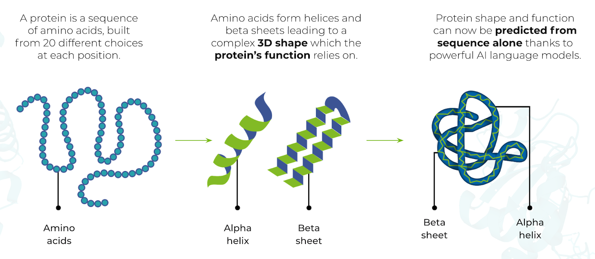
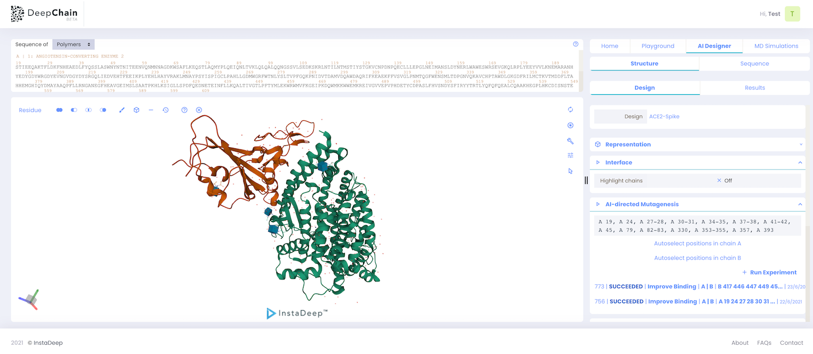
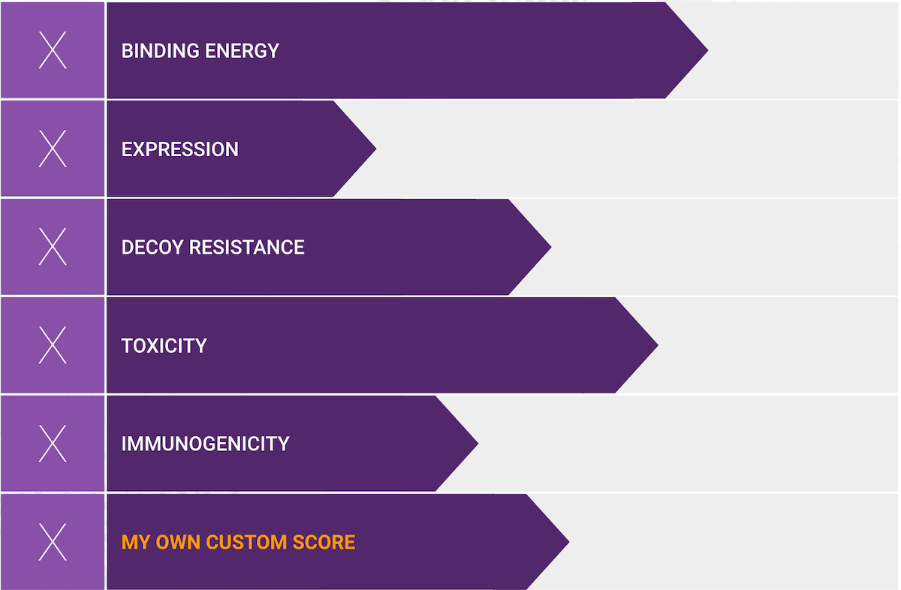
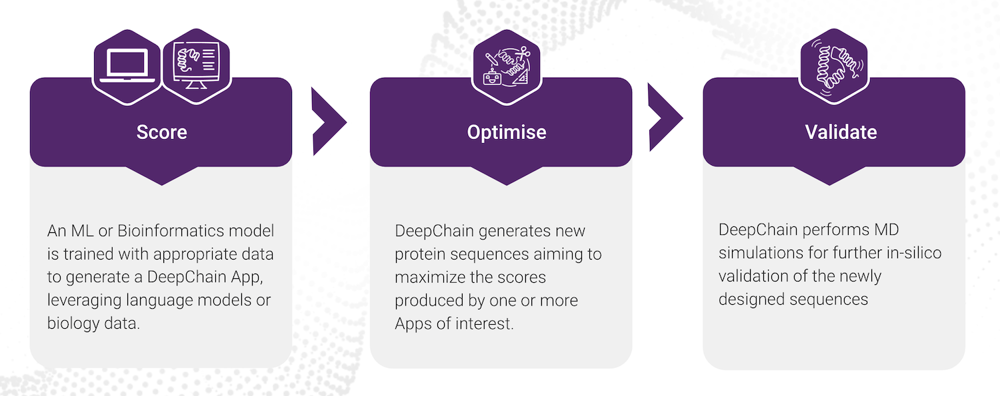
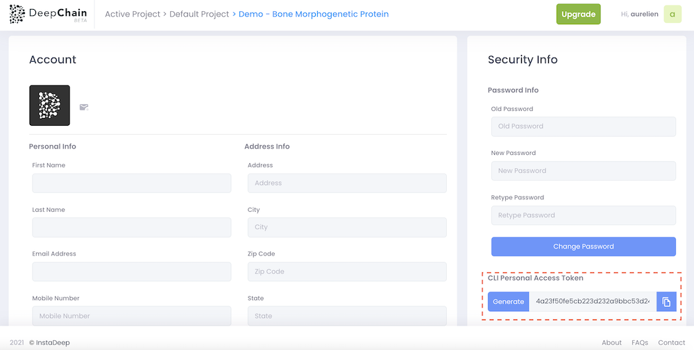

# DeepChain™
 
## Proteins...

- are the driving force of life, they catalyze reactions, transport and react to signals, build tissues, maintain balance in organism, detect and protect us from infections
- are long, linear sequences of 20 different amino acids and their function relies on the 3D structure they acquire once they are formed
- structure can be modified by mutations to the amino acid sequence, and thus, modifying this sequence
-  can acquire new or improved functions that can be used to find new medicines and vaccines

<p align="center">
  
</p>

## What is DeepChain™ ?

DeepChain™ optimises the design of new protein molecules to attain novel activity, behavior, or purpose, and to advance basic understanding of protein function. DeepChain™ at the crossroads of AI and Biology.

<p align="center">
  
</p>

## DeepChain™ MODULES & FEATURES

- **Playground**: Leverage AI models trained using UniRef100 with data on 2.1B proteins to uncover novel protein sequences and discover new protein properties

- **AI Designer**: Optimize your protein candidate sequence to its highest binding affinity towards a target, maximizing its specificity and reducing off-target effects

- **Molecular Dynamics**: Explore the behaviour of your existing protein complexes or the newly generated sequences using AI designer through powerful in-silico molecular dynamics simulation

- **Jupyter Notebook**: Conduct personalised analyses of all your structures in hosted jupyter notebooks, with the help of any Python or R library


```{tip}
Create a free account on [deepchain](https://deepchain.bio) in 2 minutes to discover protein design features.
```

## DeepChain apps for protein design

In general, protein design is a multi-objective optimisation challenge.

<p align="center">
  
</p>

DeepChain apps allows you to build your own custom score that you can optimize during the process.


<p align="center">
  
</p>


## Deepchain hub

deepchain-apps is built to be used jointly with [deepchain](https://deepchain.bio) software and customized the protein design process.
The hub allows having a look at the work of other researchers.


## Deepchain personnal account

To deploy your application on deepchain with the `cli`, you need to generate a personal access token in the settings part.

